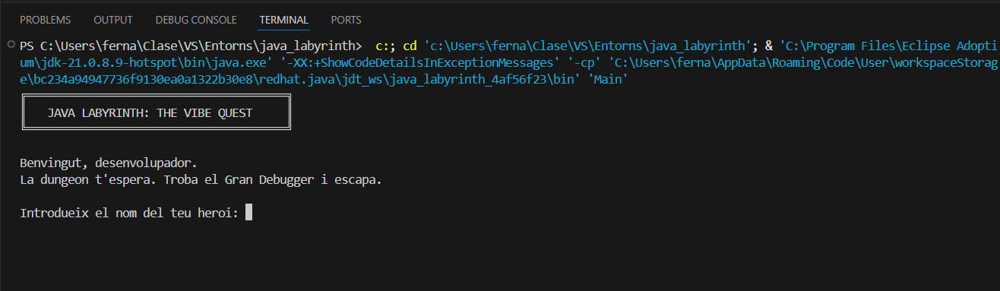

# Java Labyrinth: The Vibe Quest

## Descripció breu

**Java Labyrinth: The Vibe Quest** és un dungeon crawler textual desenvolupat en Java. El jugador controla un heroi que ha d'explorar 5 sales plenes d'errors i bugs, gestionar la seva energia i el seu inventari, i derrotar el Gran Debugger per escapar del dungeon. El joc funciona íntegrament per consola de text.

## Captura del joc



## Tecnologies utilitzades

- **Llenguatge:** Java 17+
- **IDE:** Visual Studio Code
- **Llibreries:** JUnit Platform Console Standalone 6.1.0 (tests automatitzats)
- **Eines d'IA:** Claude, ChatGPT (suport al desenvolupament, documentat a `docs/ia_log.md`)
- **Eines de modelatge:** PlantUML
- **Control de versions:** GitHub

## Com executar el projecte

```bash
# Opció 1 — Des del terminal
cd src
javac *.java
java Main

# Opció 2 — Des de VSCode
# Obrir Main.java i clicar el botó Run sobre el mètode main
```

## Com jugar

1. Introdueix el nom del teu heroi.
2. Explora les sales del dungeon de manera seqüencial.
3. Quan trobis un enemic, tria entre **Atacar**, **Defensar** o **Usar objecte**.
4. Recull els items que trobis per recuperar energia.
5. Arriba a la Sala 5 i derrota el Gran Debugger per guanyar.

Si l'energia arriba a 0, la partida acaba amb derrota. Al final de cada partida pots tornar a jugar.

## Estructura del repositori

```plaintext
java-labyrinth-vibe-quest/
├── src/           → Codi font Java
├── docs/          → Documentació tècnica del projecte
├── diagrames/     → Diagrames UML de classes i comportament
├── evidencies/    → Captures del procés de desenvolupament
├── tests/         → Casos de prova documentats
└── lib/           → Llibreries externes (JUnit)
```

## Estat del projecte

**Versió final** — Totes les fases de desenvolupament completades.

- [x] Fase 1 — Idea i abast
- [x] Fase 2 — Diagrames i model
- [x] Fase 3 — Entorn i prototip funcional
- [x] Fase 4 — Proves i depuració
- [x] Fase 5 — Documentació
- [x] Fase 6 — Refactorització i millores

## Enllaç al vídeo de gameplay

> Afegir aquí l'enllaç al vídeo de gameplay comentat un cop enregistrat.

## Autor

**Fernando Cascón**
DAM1 — Entorns de Desenvolupament
Escola Pia Santa Anna — Mataró

## Reflexió breu

Aquest projecte m'ha permès entendre el procés complet de desenvolupament de programari: des de la definició d'una idea fins a la seva implementació, verificació i millora. He après a separar responsabilitats entre classes, a escriure proves automatitzades i a documentar les decisions tècniques de manera estructurada. L'ús de la IA com a eina de suport m'ha ajudat a accelerar tasques concretes, però les decisions de disseny han estat sempre pròpies i raonades.
