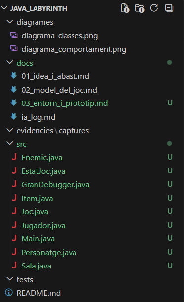

# 3. Entorn i Prototip Funcional
**Projecte:** Java Labyrinth: The Vibe Quest
**Alumne:** Fernando Cascón
**Mòdul:** Entorns de Desenvolupament — DAM1
**Data:** Maig 2026

---

## 3.1 IDE utilitzat

**Visual Studio Code (VSCode)**

S'ha escollit VSCode com a entorn de desenvolupament principal perquè és lleuger, gratuït i disposa d'un excel·lent suport per a Java mitjançant extensions. A més, integra previsualització de Markdown directament, cosa que facilita la redacció de la documentació del projecte sense canviar d'eina.

---

## 3.2 Configuració de l'entorn

### Extensions instal·lades

| Extensió | Funció |
|---|---|
| **Extension Pack for Java** | Paquet oficial de Microsoft que inclou suport complet per a Java: compilació, execució, depuració, autocompletat i gestió de projectes |

### Configuració aplicada

- **JDK:** Java 17 o superior, configurat com a runtime per defecte a VSCode.
- **Carpeta de treball:** `src/` com a directori dels fitxers font `.java`.
- **Execució:** mitjançant el botó **Run** sobre `Main.java` o des del terminal amb:

```bash
cd src
javac *.java
java Main
```

---

## 3.3 Estructura inicial del projecte

```plaintext
java-labyrinth-vibe-quest/
│
├── README.md
│
├── src/
│   ├── Main.java
│   ├── Joc.java
│   ├── Personatge.java
│   ├── Jugador.java
│   ├── Enemic.java
│   ├── GranDebugger.java
│   ├── Sala.java
│   ├── Item.java
│   └── EstatJoc.java
│
├── docs/
├── diagrames/
├── evidencies/
└── tests/
```

---

## 3.4 Decisions d'implementació inicials

### Separació de responsabilitats

S'ha optat per separar el punt d'entrada (`Main.java`) de la lògica del joc (`Joc.java`). Aquesta decisió millora la llegibilitat i permet que `Joc` sigui instanciable i testejable de manera independent, sense que el `main` contingui cap lògica pròpia.

### Classe abstracta Personatge

`Personatge` és una classe abstracta que centralitza els atributs i mètodes comuns a totes les entitats vives (`vida`, `vidaMax`, `rebreDany`, `estaViu`). Això evita duplicació de codi i permet afegir nous tipus de personatges en el futur simplement fent-los heretar de `Personatge`.

### Do-while com a bucle principal

El bucle principal del joc utilitza un `do-while` en lloc d'un `while`, ja que garanteix que la primera sala s'executa sempre abans de comprovar la condició de finalització de la partida.

### Validació d'entrades amb try-catch

Totes les entrades de l'usuari estan protegides amb un bloc `try-catch` que captura `InputMismatchException`. Això evita que el programa es tanqui de manera inesperada si l'usuari introdueix un caràcter no vàlid en lloc d'un número.

### Switch-case per a les accions de combat

Les opcions d'acció del jugador durant el combat es gestionen amb un `switch-case`, que resulta més llegible i mantenible que una cadena d'`if-else` encadenats.

### GranDebugger amb sistema de fases

El cap final (`GranDebugger`) hereta d'`Enemic` i afegeix un sistema de fases: cada vegada que perd 60 punts de vida, augmenta el seu dany base en 10. Això es comprova automàticament a cada atac sobreescrivint el mètode `atacarJugador()`.

---

## 3.5 Primer prototip funcional

El prototip inicial permet:

- Iniciar el joc i introduir el nom del jugador.
- Recórrer les 5 sales del dungeon de manera seqüencial.
- Combatre enemics amb les opcions: Atacar, Defensar o Usar Objecte.
- Recollir items i usar-los durant el combat.
- Enfrontar-se al Gran Debugger com a cap final amb sistema de fases.
- Mostrar el resultat final (VICTÒRIA o DERROTA).

### Sales del dungeon

| Sala | Contingut | Enemic / Item |
|---|---|---|
| Sala 1 — Entrada del Dungeon | Enemic | Bug Menor (30 vida, 8 dany) |
| Sala 2 — Corredor dels Logs | Item | Poció de Refactoring (+30 energia) |
| Sala 3 — Cambra del NullPointer | Enemic | NullPointerException (50 vida, 14 dany) |
| Sala 4 — Arxiu de les Dependències | Item | Kit de Debugging (+50 energia) |
| Sala 5 — Cambra del Gran Debugger | Cap final | Gran Debugger (180 vida, 25 dany base, 3 fases) |

---

## 3.6 Com s'executa el projecte

```bash
# Opció 1 — Des del terminal
cd src
javac *.java
java Main

# Opció 2 — Des de VSCode
# Obrir Main.java i clicar el botó "Run" que apareix sobre el mètode main
```

---

## 3.7 Captures de l'IDE

> Afegir captures a `evidencies/captures/` i enllaçar-les aquí:

```markdown


```
