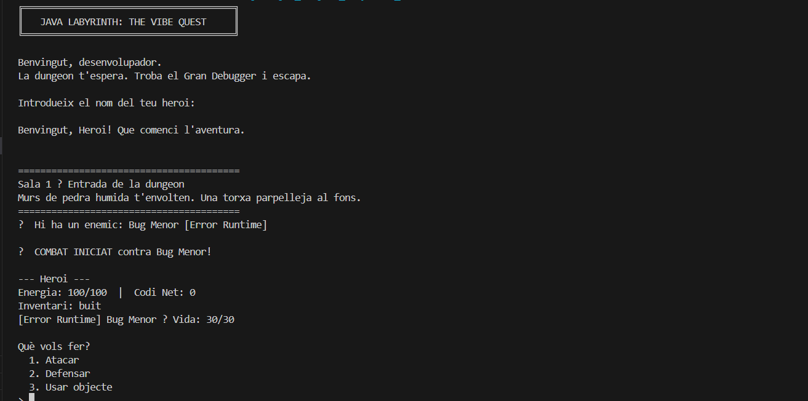
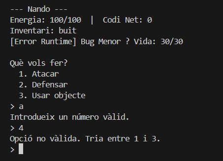
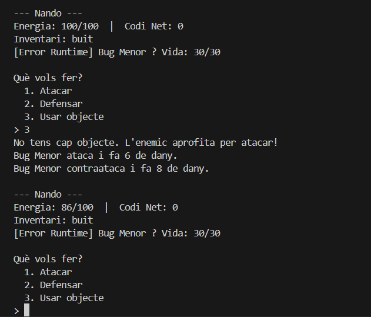
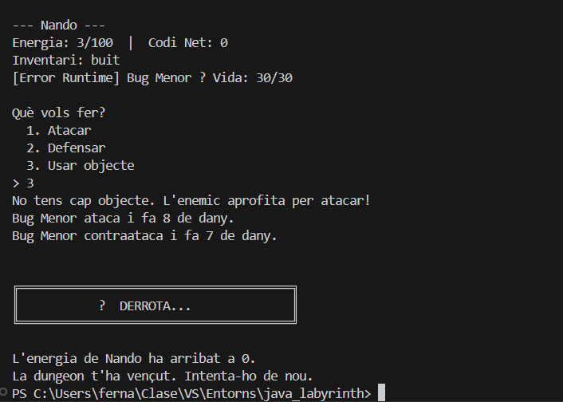
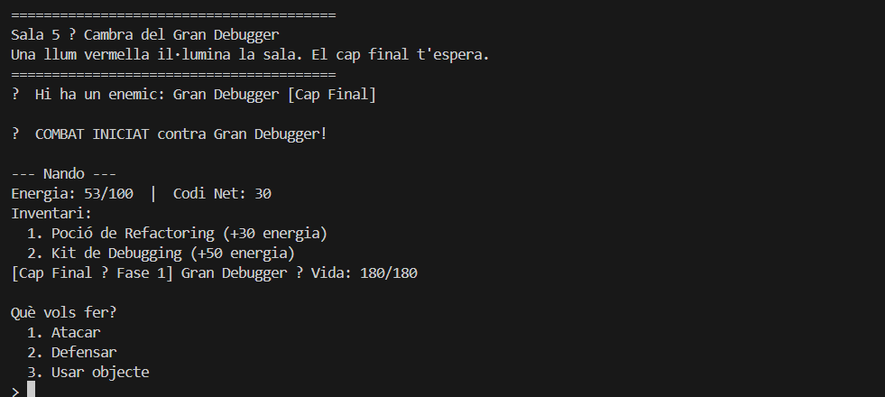
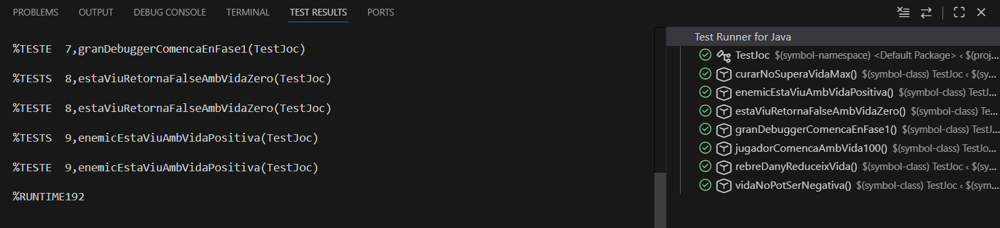

# 4. Proves i Depuració
**Projecte:** Java Labyrinth: The Vibe Quest
**Alumne:** Fernando Cascón
**Mòdul:** Entorns de Desenvolupament — DAM1
**Data:** Maig 2026

---

## 4.1 Objectiu de les proves

L'objectiu d'aquesta fase és verificar que el joc funciona correctament en tots els casos previstos i detectar comportaments inesperats. Les proves cobreixen:

- L'inici correcte del joc i la introducció del nom del jugador.
- La validació de les entrades de l'usuari al menú de combat.
- El comportament del sistema quan l'inventari és buit.
- La condició de derrota quan l'energia arriba a 0.
- L'accés correcte a la sala final i el combat contra el Gran Debugger.

---

## 4.2 Taula de casos de prova

| Codi | Objectiu | Entrada / Acció | Resultat esperat | Resultat obtingut | Estat |
|---|---|---|---|---|---|
| CP-01 | Comprovar que el joc s'inicia correctament i mostra la benvinguda | Executar `Main.java` | Es mostra el títol del joc i es demana el nom de l'heroi | Es mostra correctament | [OK] Superada |
| CP-02 | Validar que el menú de combat rebutja entrades no vàlides | Introduir `a` i després `4` | El programa mostra un missatge d'error i torna a demanar l'opció | Mostra "Introdueix un número vàlid." i "Opció no vàlida. Tria entre 1 i 3." | [OK] Superada |
| CP-03 | Comprovar el comportament en triar "Usar objecte" amb inventari buit | Seleccionar opció `3` sense items | El sistema avisa que no hi ha objectes i l'enemic aprofita per atacar | Mostra el missatge i l'enemic ataca correctament | [OK] Superada |
| CP-04 | Comprovar la condició de derrota | Deixar que l'energia arribi a 0 | El joc finalitza i mostra el missatge de DERROTA | El joc finalitza correctament amb el missatge esperat | [OK] Superada |
| CP-05 | Comprovar que s'arriba correctament a la sala final | Completar les 4 primeres sales | Es mostra la Sala 5 amb el Gran Debugger com a enemic | Es mostra correctament amb vida 180/180 i Fase 1 | [OK] Superada |

---

## 4.3 Evidències de les proves







---

## 4.4 Incidències detectades

| Codi | Descripció | Causa probable | Solució aplicada | Evidència |
|---|---|---|---|---|
| INC-01 | El nom de l'heroi podia quedar buit si l'usuari prem Enter sense escriure res | No hi havia validació explícita del camp de nom | El codi ja assignava "Heroi" per defecte amb `if (nom.isEmpty()) nom = "Heroi"`, però sense avisar l'usuari. Es considera un comportament acceptable per al prototip | — |
| INC-02 | Els emojis del codi (⚔, ✔, ⚠, ✘) es mostraven com a caràcters estranys a la consola de Windows | La consola de PowerShell de Windows no suporta UTF-8 per defecte, i el terminal de VSCode heretava aquesta configuració | Es van eliminar tots els emojis del codi i substituïts per etiquetes de text (`[ENEMIC]`, `[COMBAT]`, `[OK]`, `[!]`) que funcionen en qualsevol terminal | Captures prova_01 a prova_05 |

---

## 4.5 Depuració

### Tècniques aplicades

- **Revisió manual del codi:** revisió de la lògica del bucle de combat i les condicions de finalització de partida.
- **Execució i observació:** execució del joc complet diverses vegades provant casos límit (inventari buit, entrades no vàlides, derrota forçada).
- **Prints de control:** durant el desenvolupament es van afegir missatges de sortida per verificar els valors de `vida`, `danyBase` i `faseActual` del Gran Debugger en cada torn.

### Exemple de problema resolt — INC-02

#### Problema
Els emojis del codi (`⚔`, `✔`, `⚠`, `✘`) es mostraven com a caràcters corruptes a la consola de Windows.

#### Causa
La consola de PowerShell de Windows utilitza la pàgina de codis 850 per defecte, que no suporta caràcters Unicode com els emojis. El terminal de VSCode heretava aquesta configuració.

#### Solucions provades

**Intent 1 — `chcp 65001`:** Es va executar `chcp 65001` al terminal per activar UTF-8. Resultat: els caràcters seguien corromputs perquè Java utilitzava el seu propi encoding internament.

**Intent 2 — `PrintStream` amb UTF-8:** Es va afegir `System.setOut(new PrintStream(System.out, true, "UTF-8"))` a `Main.java`. Resultat: el compilador va llançar `UnsupportedEncodingException` i calia gestionar l'excepció amb `try-catch`, però el problema persistia.

#### Solució definitiva aplicada
Es van eliminar tots els emojis del codi i substituïts per etiquetes de text entre claudàtors. Aquesta solució és la més robusta perquè no depèn de la configuració del terminal ni del sistema operatiu.

```java
// Abans
System.out.println("⚔  COMBAT INICIAT contra " + enemic.getNom() + "!");
System.out.println("✔ Has derrotat " + enemic.getNom() + "!");

// Després
System.out.println("[COMBAT] COMBAT INICIAT contra " + enemic.getNom() + "!");
System.out.println("[OK] Has derrotat " + enemic.getNom() + "!");
```

## 4.6 Resultats dels tests automatitzats


