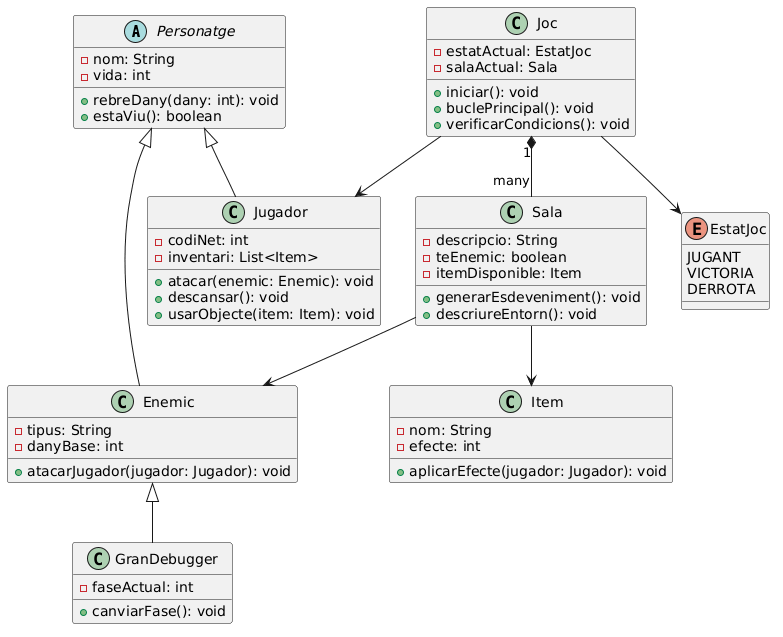
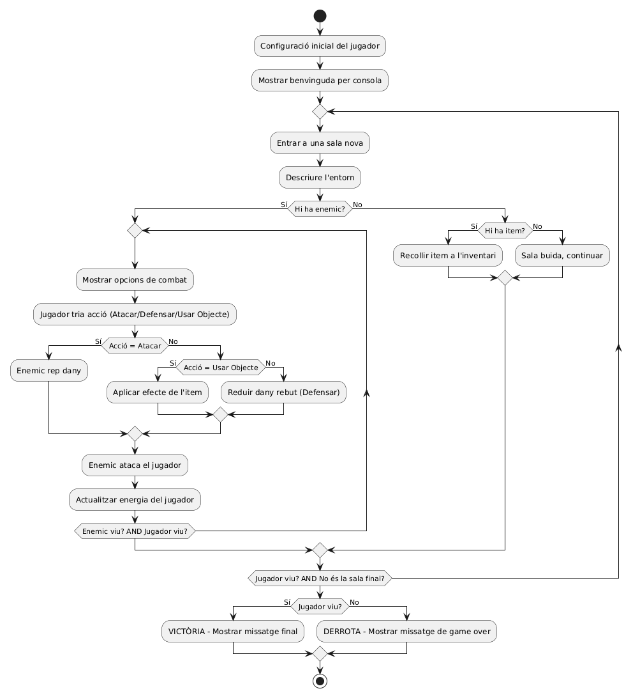

# Manual Tècnic
**Projecte:** Java Labyrinth: The Vibe Quest
**Alumne:** Fernando Cascón
**Mòdul:** Entorns de Desenvolupament — DAM1

---

## Arquitectura general

El projecte segueix una arquitectura orientada a objectes amb separació clara de responsabilitats. La lògica del joc està centralitzada a `Joc.java`, mentre que cada entitat del sistema té la seva pròpia classe. El punt d'entrada és `Main.java`, que simplement instancia i inicia el joc.

---

## Estructura de carpetes

```plaintext
java-labyrinth-vibe-quest/
│
├── src/
│   ├── Main.java
│   ├── Joc.java
│   ├── Personatge.java
│   ├── Jugador.java
│   ├── Enemic.java
│   ├── GranDebugger.java
│   ├── Sala.java
│   ├── Item.java
│   ├── EstatJoc.java
│   └── TestJoc.java
│
├── docs/
├── diagrames/
├── evidencies/
├── tests/
├── lib/
│   └── junit-platform-console-standalone-6.1.0.jar
└── README.md
```

---

## Components principals del codi

| Component | Fitxer | Responsabilitat |
|---|---|---|
| `Main` | `Main.java` | Punt d'entrada. Instancia i inicia `Joc`. |
| `Joc` | `Joc.java` | Orquestra el bucle principal, el combat, els items, les sales de descans i el final de partida. |
| `Personatge` | `Personatge.java` | Classe abstracta base per a totes les entitats vives. |
| `Jugador` | `Jugador.java` | Gestiona l'energia, l'atac, la puntuació, l'inventari i les accions del jugador. Inclou `boostAtac()` per equipar l'arma. |
| `Enemic` | `Enemic.java` | Representa els enemics de les sales amb dany aleatori. Mostra vida i dany a la consola. |
| `GranDebugger` | `GranDebugger.java` | Cap final (100 vida, 18 dany base) amb sistema de fases que augmenta el dany en 8 cada 50HP perduts. |
| `Sala` | `Sala.java` | Conté la descripció de l'entorn i els esdeveniments. Mostra les stats de l'enemic en entrar. |
| `Item` | `Item.java` | Objectes recollibles que restauren energia al jugador. |
| `EstatJoc` | `EstatJoc.java` | Enum amb els estats possibles de la partida: JUGANT, VICTORIA, DERROTA. |
| `TestJoc` | `TestJoc.java` | Tests automatitzats JUnit per verificar la lògica del joc. |

---

## Jerarquia de classes

```plaintext
Personatge (abstracta)
├── Jugador
└── Enemic
    └── GranDebugger
```

---

## Flux principal del programa

1. `Main.main()` instancia `Joc` i crida `iniciar()`.
2. `iniciar()` crida `mostrarBenvinguda()`, `crearJugador()` i `crearSales()`.
3. `crearSales()` genera les sales comunes i demana la bifurcació al jugador.
4. `buclePrincipal()` s'executa amb un `do-while` fins que `estatActual != JUGANT`.
5. En cada iteració es processa una sala: combat, item, sala de descans o sala buida.
6. Si la sala és una **sala de descans**, s'ofereix usar items de l'inventari via `ofertarUsarItems()`.
7. `verificarCondicions()` comprova si el jugador ha mort o ha guanyat.
8. `mostrarFinal()` mostra el resultat i ofereix tornar a jugar.

---

## Diagrames




---

## Decisions tècniques

| Decisió | Justificació | Alternativa descartada |
|---|---|---|
| Classe abstracta `Personatge` | Centralitza atributs i mètodes comuns a `Jugador` i `Enemic`, evitant duplicació de codi (DRY) i facilitant l'escalabilitat | Dues classes independents sense jerarquia |
| `do-while` com a bucle principal | Garanteix que la primera sala s'executa sempre abans de comprovar la condició de finalització | `while` estàndard |
| `switch-case` per a les accions de combat | Més llegible i mantenible que una cadena d'`if-else` amb múltiples opcions | `if-else` encadenats |
| `try-catch` per a les entrades | Evita que el programa es tanqui amb `InputMismatchException` si l'usuari introdueix un caràcter no vàlid | Sense validació |
| Etiquetes de text en lloc d'emojis | Els emojis no es mostren correctament a la consola de Windows per problemes d'encoding | Emojis Unicode |
| `Main.java` separat de `Joc.java` | El punt d'entrada no conté lògica pròpia, cosa que fa el codi més llegible i el joc instanciable de manera independent | Tot al `main` |
| Bifurcació de camins a la Sala 3 | Trenca la linealitat del joc i introdueix una decisió real per al jugador: risc/recompensa (Camí A) vs seguretat/recursos (Camí B) | Recorregut completament lineal |
| Espasa de Codi com a arma auto-equipable | L'arma augmenta l'atac directament sense ocupar espai a l'inventari. Es detecta pel nom a `recollirItem()` i crida `boostAtac()` | Arma com a item d'inventari usable |
| Sales de descans amb `ofertarUsarItems()` | Permet al jugador preparar-se abans del cap final usant tots els items de l'inventari en un bucle | Curació automàtica sense control del jugador |
| Stats dels enemics visibles | El jugador veu la vida i el dany aproximat de l'enemic tant en entrar a la sala com durant el combat | Informació oculta |

---

## Com executar els tests

```bash
# Des de VSCode
# Obrir la pestanya Testing a la barra lateral i clicar Run All Tests

# Des del terminal
cd src
javac -cp .;../lib/junit-platform-console-standalone-6.1.0.jar *.java
java -jar ../lib/junit-platform-console-standalone-6.1.0.jar --class-path . --scan-class-path
```

---

## Possibles millores futures

- Afegir un sistema de guardat de partida amb fitxers (`FileWriter` / `BufferedReader`).
- Implementar més tipus d'enemics amb comportaments diferenciats mitjançant polimorfisme.
- Afegir un sistema de nivells per al jugador que augmenti l'atac progressivament.
- Implementar un rànquing de puntuacions per comparar partides.
- Migrar el projecte a Maven per gestionar les dependències de manera professional.
